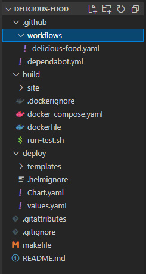
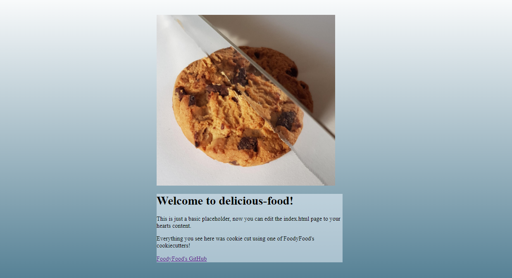
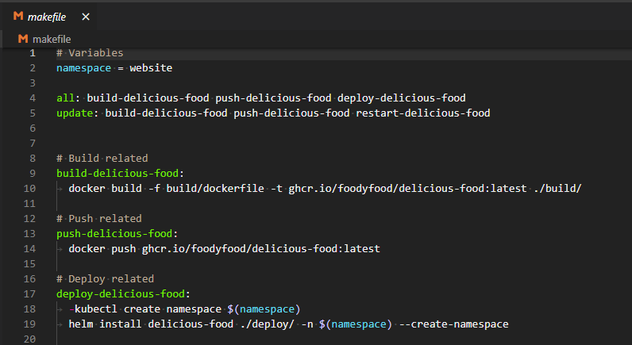
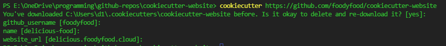

# FoodyFood's Website CookieCutter

I found myself creating the same basic folder layouts quite often.

They always featured helm, dockerfiles, some makefile and a readme.

So I decided to make myself some cookie cutters to get these rough templates thrown together quicker.

### What Does It Do

Out of the box it will create a folder structure typical of most projects



If you go into the /build/site folder, you will see if it has given you a basic index.html that you can use to start with.



If you type make all, it will build you a docker image locally, push it to your github container registry, and attempt to install it using a helm chart on your default cluster (kubectl config get-contexts)




### Using The CookieCutter

To get started, install cookiecutter
```bash
pip install cookiecutter
```

Then run
```bash
https:
cookiecutter https://github.com/foodyfood/cookiecutter-website
ssl:
cookiecutter git@github.com:foodyfood/cookiecutter-website.git
```

It will ask you 3 questions, your GitHub username, the name of your website, and the website URL.




If you press 'ENTER' it will use these defaults
```bash
github_username: foodyfood
name delicious-food
website_url delicious.foodyfood.cloud
```

Finally, this will have created a project in the directory your terminal was open in
and you can build and deploy your project by typing this in the folder it created
```bash
make all
```

